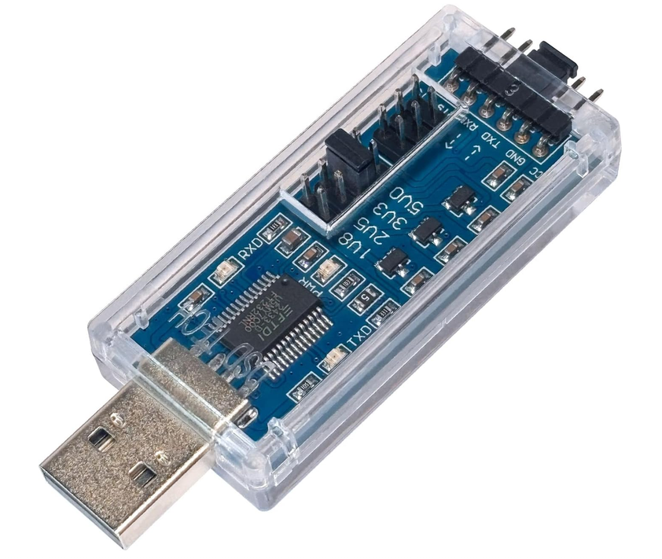
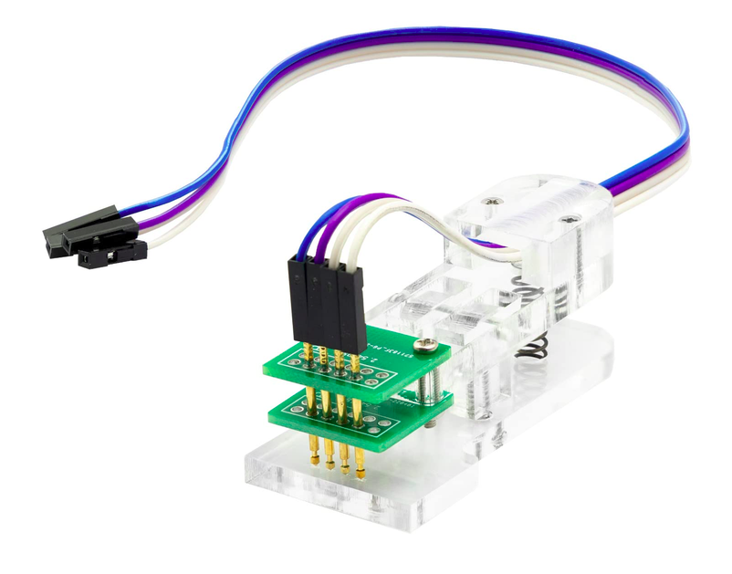
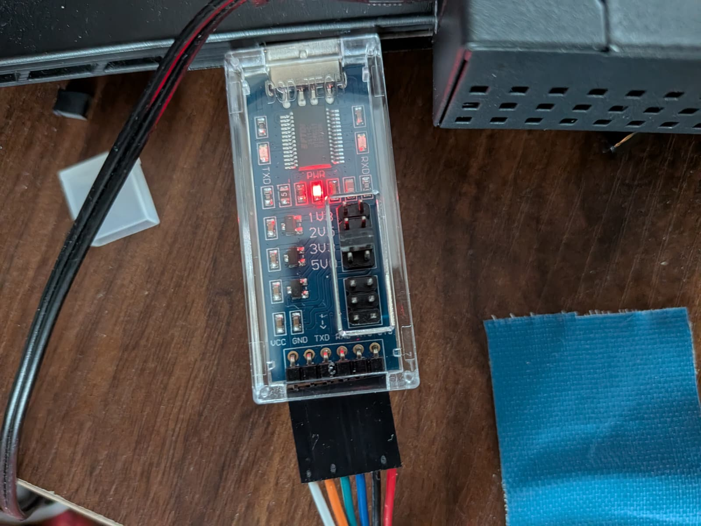

# openwrt-eap225-outdoor-v3

Ich habe erfolgreich openwrt auf einen eap225-outdoor mit der neusten tplink firmware installiert. Die neuste Firmware sperrt die Installation von alter TP-Link firmware sowie fremder wie OpenWrt. Auf diesem Weg kann mann dennoch von der offiziellen Firmware abweichen.

<h3>Benötigtes Material</h3>
<table>
<tr><td></td><td>DSD TECH SH-U09C5 USB zu TTL UART Konverter Kabel mit FTDI Chip Unterstützung 5V 3.3V 2.5V 1.8V TTL</td><td>https://amzn.eu/d/0cvFHawQ</td></tr>
<tr><td></td><td>AZDelivery 4 Pin Programmer I2C Modul Test Werkzeug PCB Klemme 1 * 4P Gold-beschichtete Pogo Pins</td><td>https://amzn.eu/d/02t9oDBm</td></tr><tr><td colspan="3">Schraubenzieher schlitz mit kleiner breite</td></tr><tr><td colspan="3">Switch mit oder ohne PoE</td></tr>
</table>
<h3>Benötigte Dateien</h3>
<table>
<tr><td>Initramfs (für U-Boot / RAM)</td><td><a href="https://downloads.openwrt.org/releases/23.05.5/targets/ath79/generic/openwrt-23.05.5-ath79-generic-tplink_eap225-outdoor-v3-initramfs-kernel.bin">OpenWrt 23.05.5 "initramfs"</a></td><td>ACHTUNG erst mal eine alte version flashen. Die neuen sind zu groß.</td></tr>

<tr><td>Sysupgrade (später für LuCI)</td><td><a href="https://downloads.openwrt.org/releases/25.12.1/targets/ath79/generic/openwrt-25.12.1-ath79-generic-tplink_eap225-outdoor-v3-squashfs-sysupgrade.bin">OpenWrt 25.12.1 "sysupgrade"</a></td><td></td></tr>
</table>

<h3>Vorbereitung</h3>
<ul><li>Installieren von picocom</li><li>installieren von tftp</li><li>tftp configurieren und datien kopieren</li><li>USB zu TTL Stick auf 3,3V einstellen</li><li>Netzwerkanschluss herstellen und ips 192.168.0.66/24, 192.168.0.100/24 und 192.168.1.2/24 einstellen <i>Über die IP 192.168.0.66 oder 192.168.0.100 zieht der EAP sich nacher mit TFTP die Firmware. 192.168.1.1 ist im Anschluss standart IP von OpenWrt</i></li></ul>

<code>apt update
apt install picocom
apt install tftp-hpa
</code> 
<code>
cp /FOLDER/openwrt-23.05.5-ath79-generic-tplink_eap225-outdoor-v3-initramfs-kernel.bin /srv/tftp/initrams.bin
</code> 
<i>Zu lange Dateinamen können Fehler verursachen. tftp kann durch die Firewall geblockt werden. Vor kopieren Funktionstest durchführen.</i>
 
<h3>Öffnen EAP225-Outdoor</h3>

Unter den Antennen sind Aufkleber zur Dichtung. Diese entfernen. Unter den Aufklebern sind Muttern mit Schlitz. Den Schraubenzieher in den Schlitz einführen und Mutter duch drehen entfernen. Im Anschluss Unterlegscheibe entfernen und EAP225-Outdoor nach unten entfernen. <i>Achtung. 2 Dichtungsringe für Außen und 2 Dichtungsringe für Innen beim nach unten weg schieben des EAP225 sichern.</i>

 
<h3>EAP225 Platine</h3>

Auf der Platine befinden sich 4 Pins. TX, RX, GND und VDD. <strong>ACHTUNG PIN VDD NIEMALS ANSCHLIEßEN</strong> 

<h3>Pogo Pins Anschließen</h3>

Die Klemme mit den Pins auf die Platine aufsetzen. Die Pins TX und RX zwischen Platine und USB Stick tauschen. TX -> RX RX -> TX GND -> GND 

<h3>Picocom starten</h3>
<code>sudo picocom -b 11520 --flow n --parity n --databits 8 /dev/ttyUSB0</code> 

<h3>EAP225-Outdoor mit Strom versorgen</h3>
EAP225-Outdoor mit POE mit Strom versorgen und Ausgabe auf console beobachten. Ausgabe sollte folgendermaßen aussehen:
 
Wenn Ausgabe passt, dann Stromverbindung trennen und vor dem wieder anschließen <strong>STRG+B</strong> drücken und halten. Dann EAP225 mit strom versorgen. Im Anschluss landet Ihr in der console vom EAP225.
 
<h3>Laden der Firmware vom TFTP Server (Lokaler Rechner)</h3>
<code>tftp 0x82000000 initrams.bin</code> 
<i>Hin und wieder meldet die Console, dass sie den Befehl tftp nicht kennt.... beim nochmaligen probieren klappt es dann in der Regel. In dem Beispiel Bild ist der Dateiname etwas abgewandelt.</i>
 
<h3>Firmware in den Speicher laden</h3>
<code>bootelf</code> 

<h3>Start OpenWrt</h3>

Nach ein 1-2 Minuten kann OpenWrt angesprochen werden.

Wenn das läuft muss die Firmware aber noch komplett installiert werden. Bisher ist nur das Initrams insatlliert. Nach Stromverlust vergisst der Repeater das.

Neuste Firmware Downloaden und Sysupgrade installieren.

